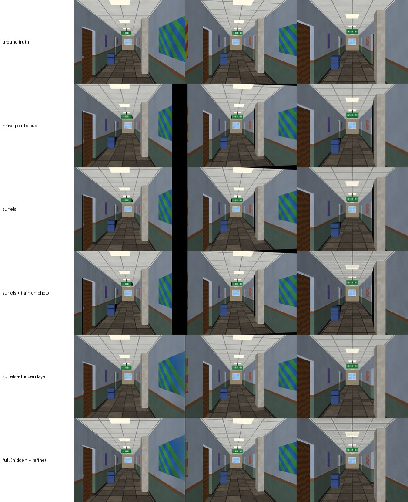

# One photo → 3D Gaussian Splatting: survey, design decisions and tests (October 2026)

**Goal.** Build a 3D Gaussian Splatting (3DGS) scene from **one image** of a static interior (corridor),
viewable from viewpoints **near** the one the photo was taken from. Runs on Colab (GPU) and,
more slowly, on CPU.

**Original proposal.** (1) monocular depth model → initial point cloud instead of video + COLMAP;
(2) train 3DGS on the one image.

## TL;DR

| Question | Answer |
|---|---|
| Is "depth → point cloud → train 3DGS on the one image" sound? | **Partly.** Step 1 is the right backbone. Step 2 alone barely helps novel views: one photo carries no depth information, so training can only sharpen the input view. Left unconstrained, it degrades geometry (Gaussians slide along their viewing rays). The real failure mode is elsewhere: **holes behind every occluding edge and beyond the frame** as soon as the camera moves. |
| What this repository does instead | depth (MoGe-2) → **one surface-aligned Gaussian per pixel** (pixel-footprint covariance, depth edges cut by a parallax test) → **hidden background layer** behind occluding edges + **border extension** (planar depth continuation + LaMa inpainting) → **geometry-anchored single-view refinement** → standard `.ply`. |
| Depth model | **MoGe-2** (Microsoft, NeurIPS 2025, **MIT**): metric point map **+ camera FoV + normals**. Fallback: Depth Anything V2 (ONNX, relative depth, needs a FoV). MoGe-3 (2026) optional on CUDA. |
| Strongest alternative | **Apple SHARP** (Dec 2025): a network trained end-to-end for exactly this task (single photo → 3DGS for nearby views, <1 s). Likely higher quality, but **research-only licence**, and its weights could not be downloaded in this sandbox. Wired in as `--set method=sharp` for a direct comparison on Colab. |
| If you need to *walk down* the corridor | Different problem class: generative video/multi-view diffusion → 3DGS (NVIDIA **Lyra**, **GEN3C**, Stability **Stable Virtual Camera**, WonderWorld, World Labs Marble). Hallucinates unseen space; heavy GPU; mostly non-commercial licences. |

## 1. What one photo can and cannot give you

* **Recoverable:** colour of every visible surface point; its depth (only through a learned prior,
  i.e. a monocular depth model); the camera FoV (again a prior, or EXIF).
* **Not recoverable, must be synthesised:** everything behind occluders (door frames, pillars,
  furniture) and everything outside the frame. The amount grows with camera motion:
  two surfaces at disparities d₁ > d₂ separate by `f·b·(d₁ − d₂)` pixels for a sideways move `b`.
* **"No camera movement"** in the request means the *input* is a single static shot. The *viewer*
  must still move a little, otherwise 3D is pointless. Every method here is valid for motion of
  a few percent of the scene depth (head-motion parallax, "3D photo"). SHARP's authors scope
  their model the same way ("nearby views").

## 2. Approaches considered

| Family | Examples (year) | How it works | Fit for this task |
|---|---|---|---|
| Depth-lifted + optimise (original proposal) | many in-house pipelines; DepthSplat / FSGS-style depth priors | monocular depth → points → 3DGS training | Transparent and licence-friendly. Needs explicit occlusion handling and geometry anchoring (this repo adds both). |
| Layered depth "3D photo" | 3D Photo Inpainting (Shih et al., CVPR 2020), SLIDE (ICCV 2021) | layered depth image; background behind depth edges inpainted (colour + depth) | Same viewing range as ours. The idea is reused here as a Gaussian hidden layer. |
| Feed-forward single-image 3DGS | **SHARP** (Apple, 2025), Flash3D (2024), MLGS (ACM MM 2026), studentSplat (2026), diffusion "splatter images" (2025) | a network regresses Gaussians (SHARP: 2 depth layers, metric) in one pass | Best quality per second for nearby views. SHARP: <1 s; reported LPIPS −25–34 % vs the best prior model. Research-only licence. |
| Generative world models | **Lyra** (NVIDIA, ICLR 2026) & Lyra 2.0, **GEN3C** (CVPR 2025), **Stable Virtual Camera** (2025), ViewCrafter, FlashWorld, WonderWorld, Scene Splatter, ExScene | camera-controlled video diffusion generates many views → 3DGS (or distilled directly) | Needed for large motion (walking into the corridor). Content is hallucinated and can drift from the photo. 24–80 GB GPUs. |

**Decision.** For "static splatting" (one photo, small motion) the depth-lifted pipeline is
kept as the backbone, because it is simple, inspectable, permissively licensed and runs anywhere.
Two components are added, because analysis and the tests below show they matter more than
training: occlusion handling and geometry anchoring. SHARP is included as a switchable
baseline so the two can be compared on the same photo.

## 3. Depth / geometry model

What the lifting step needs: **depth with the right shape, and the camera focal length.**
A relative-depth model (affine-invariant *disparity*) has an unknown shift and no FoV, so
unprojecting it bends planes. Corridors, made of long planes, show this immediately.

| Model | Output | Licence | Notes |
|---|---|---|---|
| **MoGe-2** (Microsoft, NeurIPS 2025) | metric point map, depth, **FoV**, normals, sky mask | **MIT** (DINOv2 parts Apache-2.0) | Its paper reports the best average rank against UniDepth V2, Depth Pro, MASt3R, Depth Anything V1/V2, Metric3D and others on 10 benchmarks, including NYUv2, iBims-1 and HAMMER. Depth Pro has sharper boundaries on some sets. **Default here.** |
| MoGe-3 (2026 preprint, weights released) | as MoGe-2, finer detail (sparse volumetric refinement) | MIT | Needs FlexGEMM/Triton (CUDA). Optional `depth.model=moge3`. Self-reported gains over MoGe-2. |
| Depth Pro (Apple, 2024) | metric depth + focal | Apple research licence | sharp edges; non-commercial |
| Depth Anything 3 (ByteDance, Nov 2025) | any-view geometry, metric variant | mixed (Large/Giant CC-BY-NC; metric-large reported Apache-2.0) | Strongest as a *multi-view* model. Its 3DGS head is pose-conditioned, not monocular. |
| UniDepth V2 | metric depth + camera | CC-BY-NC | — |
| **Depth Anything V2** (2024) | relative disparity only | Small Apache-2.0, Base/Large CC-BY-NC | Offline / CPU fallback (`depth.model=dav2`, ONNX from a GitHub release). Needs a FoV (EXIF, or `depth.fov_deg`). |

Sources: MoGe-2 paper ([arXiv 2507.02546](https://arxiv.org/abs/2507.02546)) and
[repo](https://github.com/microsoft/MoGe); MoGe-3 ([arXiv 2607.17967](https://arxiv.org/abs/2607.17967));
Depth Anything 3 ([arXiv 2511.10647](https://arxiv.org/abs/2511.10647)). All comparisons are the
authors' own. No independent indoor-only benchmark was found.

## 4. Why not gsplat / the Inria rasterizer

One image means about one Gaussian per pixel (≤ 1 M) and a few hundred optimisation steps. The
fragment-based rasterizer in `ssplat/rasterize.py` is pure PyTorch:
* no CUDA compilation (that step dominated setup time in the video pipeline);
* runs on CPU, so it was developed and tested in a GPU-less sandbox;
* implements the same image model as the reference renderer: EWA projection, 0.3 px² dilation,
  α = min(0.99, o·G), α < 1/255 skipped, early stop at T < 1e-4. Exported `.ply` files therefore
  look the same in standard viewers.
* `tests/test_rasterize.py` checks it against a brute-force per-pixel implementation (exact
  match) and its gradients against finite differences.

Speed on this machine's 4 CPU cores: ~1 s per optimisation step for 512×384 (200 k Gaussians). A
GPU is 1–2 orders of magnitude faster.

## 5. The method in detail

1. **Geometry.** MoGe-2 → depth `D`, intrinsics `K`, sky/invalid mask (clamped far).
2. **Flying pixels.** Depth networks blur depth edges over a few pixels. Lifted to 3D, those pixels
   hang in mid-air and smear as streaks. In zones where the 3×3 disparity range forms an occlusion
   edge, disparity is snapped to the near or far side, decided on the locally averaged disparity
   (a spatially coherent decision, no dithering). `geometry.sharpen_depth_edges`.
3. **Occlusion edges from physics.** A neighbour pair is cut iff a camera move of
   `b = occlusion.max_baseline × median depth` would open a gap ≥ `edge_parallax_px` (1 px), plus
   a 3 % relative jump. Steep but smooth surfaces are not cut: a corridor floor near the vanishing
   point has tiny per-pixel disparity steps. `geometry.occlusion_edges`.
4. **Surface Gaussians.** For pixel `p`, take the 3D steps to its right and lower neighbours
   *on the same surface* (one-sided differences that never cross a cut): `J = [∂P/∂u, ∂P/∂v]`.
   Then `Σ = σ²JJᵀ + thin normal term`. This is the pixel's footprint on the surface. From the
   input camera every Gaussian covers exactly its pixel. From a new viewpoint neighbours still
   overlap, so walls and floors stay closed (no cracks, even at grazing angles), and cut edges
   separate cleanly (no rubber sheets). `geometry.footprint_gaussians`.
5. **Hidden layer + border** (`occlusion.py`):
   * *strip width* behind each foreground edge pixel = the gap it can open, `⌈f·b·Δd⌉` + margin;
   * *strip depth* = planar continuation of the **far side's** disparity from the nearest
     trusted background pixel. Disparity is affine in pixel coordinates on any plane, so walls,
     floors and door recesses continue exactly behind the occluder. Background slopes use
     normalised (mask-aware) smoothing so the foreground never leaks into them;
   * *border* = canvas padded by the parallax the motion can reveal (+ the look-at rotation),
     depth continued from the image border the same way;
   * *colour* = LaMa inpainting. The foreground next to each strip is masked too, so LaMa
     copies background, not foreground, texture.
6. **Single-view refinement** (`optimize.py`) of the visible layer only. Loss: L1 + 0.2 D-SSIM
   on the photo, + depth loss to `D`, + anchor loss on each Gaussian's distance along its ray,
   + a small flatness term. The hidden layer is frozen: the photo carries no information about it.
7. **Export**: standard 3DGS `.ply` (SH degree 0), camera at the origin; `.html`/`.spz`/`.glb`
   via PlayCanvas splat-transform. Preview grid and swing/circle/dolly videos.

## 6. Experiments

Everything below ran on the development sandbox: **4 CPU cores, no GPU**. Hugging Face and the
Apple CDN were blocked by the sandbox's network policy, so **MoGe-2 and SHARP could not be run
with real weights here**. Their wiring was tested with randomly initialised weights. The
monocular depth model used in these experiments is therefore the fallback, Depth Anything V2-Large
(ONNX, from a GitHub release). Ground-truth or measured depth stands in for "good metric depth".

### 6.1 Synthetic corridor (exact ground truth)

`bench/synthetic_corridor.py` ray-traces a 2.5 m wide, 19 m long corridor at 512×384, 70° FoV:
tiled floor, panel ceiling with lights, painted walls with posters, four recessed doors, a pillar,
a cabinet, a hanging sign and an end window. The view from the reference camera is the "photo".
Ten novel views are rendered exactly: sideways ±0.1/±0.2/+0.3 m, up/down 0.15 m, forward 0.5/1.0 m,
and an orbit 0.25 m to the side looking back at the scene centre (median depth 3.1 m). Metrics
are averaged over the ten views. *seen / unseen* split each view into pixels visible in the photo
and pixels that are not (disoccluded or out of frame; 2–25 % of a view).

| Depth | Variant | PSNR ↑ | SSIM ↑ | PSNR seen | PSNR unseen | coverage |
|---|---|---|---|---|---|---|
| ground truth | naive point cloud (isotropic splats) | 21.40 | 0.846 | 29.92 | 9.17 | 94.8 % |
| ground truth | surfels (footprint Gaussians + edge cuts) | 21.34 | 0.872 | 31.63 | 8.77 | 94.6 % |
| ground truth | surfels + train on the photo (original step 2) | 21.23 | 0.887 | **36.58** | 8.55 | 94.5 % |
| ground truth | surfels + hidden layer | 29.68 | 0.921 | 31.58 | **21.30** | 99.98 % |
| ground truth | **full** (hidden layer + refinement) | **31.95** | **0.937** | **36.62** | **21.45** | 99.98 % |
| Depth Anything V2 | naive point cloud | 21.13 | 0.823 | 28.49 | 9.21 | 95.0 % |
| Depth Anything V2 | surfels | 20.88 | 0.838 | 29.08 | 8.66 | 94.7 % |
| Depth Anything V2 | surfels + train on the photo | 20.63 | 0.830 | 29.54 | 8.50 | 94.7 % |
| Depth Anything V2 | surfels + hidden layer | 28.12 | **0.887** | 29.27 | 21.12 | 99.95 % |
| Depth Anything V2 | **full** | **28.48** | 0.879 | **29.84** | **21.32** | 99.94 % |

Depth Anything V2 here: AbsRel 0.043, δ1 0.9999 after median scaling, with the 0.1 offset prior
(§6.2). Unseen pixels make up 1–13 % of a view, depending on the motion. Input-view PSNR after
200 refinement steps: 55–61 dB (32–33 dB before). Run: `python -m bench.run_benchmark`.

**What this says about the original design**
1. **The hidden layer is the biggest single gain (+8.3 dB PSNR overall).** Without it, every
   disoccluded or out-of-frame pixel is a hole (~9 dB PSNR there; ~21 dB with the layer + LaMa),
   and full-image PSNR stays capped around 21 dB no matter how good the rest is.
2. **"Train 3DGS on the one image" helps only where the photo saw the surface, and only if the
   depth is right.** With exact depth it raises seen-region PSNR by +5 dB (31.6 → 36.6): the
   per-pixel Gaussians slightly blur the photo and the refinement removes that. With estimated
   depth the gain shrinks to +0.5 dB and SSIM is flat, because geometry error then dominates and
   sharper colours on slightly wrong geometry do not look better. It is worth keeping (cheap, never
   harmful here, large gain with good depth), but it is not the core of the method.
3. **Depth quality sets the ceiling.** 0.043 AbsRel already costs 3.5 dB versus exact depth.
   That is why the depth model choice (§3, §6.2) matters more than any 3DGS trick.
4. Surfels vs isotropic points: same PSNR, clearly better SSIM (closed surfaces, no speckle at
   grazing angles), and they make the refinement and the hidden layer work.

### 6.2 Depth: why the depth model must give shape *and* camera

Depth Anything V2-Large (relative disparity), each map scaled to the true median depth:

| Scene | AbsRel / δ1, disparity used as-is | **+0.1 × max offset (default)** | oracle scale + shift |
|---|---|---|---|
| synthetic corridor | 0.219 / 0.863 | **0.041 / 1.000** | 0.039 / 1.000 |
| NYUv2 #50 (basement corridor) | 0.362 / 0.678 (far end at 48 m; true 7.4 m) | **0.113 / 0.887** | 0.090 / 0.960 |
| NYUv2 #0 (held out) | diverges (AbsRel 270) / 0.668 | **0.133 / 0.786** | — |
| NYUv2 #100 (held out) | diverges (AbsRel 14 551) / 0.717 | **0.085 / 0.940** | — |

* The network's *shape* is good: AbsRel 0.04–0.09 once the right affine map is known.
* The unknown **disparity shift** dominates the error. Relative models normalise the farthest
  point to disparity ≈ 0, so the end of a corridor shoots off towards infinity. Corridors are
  the worst case, because they span a long depth range in one view.
* A fixed offset of 0.1 × max disparity ("the far end is about 10× farther than the nearest
  point") fixes most of it on interiors. It was chosen on two scenes and validated on two
  held-out NYUv2 frames. It is a **prior, not a measurement**: use 0 outdoors.
* MoGe-2 estimates scale, shift and FoV from the image itself. That is why it is the default; a
  relative-depth model is only the fallback.

### 6.3 Engineering findings that changed the design

* **Flying pixels → streaks.** Snapping must be spatially coherent. A per-pixel near/far
  decision produced dithered edges; deciding on the locally averaged disparity fixed it.
* **"Zebra" stripes on steep surfaces.** A relative-jump edge threshold (3 %) is secretly a
  grazing-angle test of ~86° at 500 px focal length. Near surfaces seen almost edge-on (a
  shelf top) were cut into fronto-parallel disks that separate when the camera moves, letting
  the background show through in stripes. The explicit 88° grazing-angle criterion keeps them
  closed. Novel-view holes on the NYU corridor dropped to 0.4–0.5 % of pixels.
* **Hidden depth must extrapolate the far side only.** Taking the nearest "background" pixel
  sometimes picked the occluder's own interior and bent the hidden surface forwards. Fixed by
  restricting sources to pixels behind nearby edges, and by mask-aware slope estimation
  (both caught by `tests/test_geometry.py`).

### 6.4 Real corridors

Three public photos (fetched by `bench/real_corridors.sh`; not redistributed here). All were
run on CPU with Depth Anything V2 + the 0.1 prior, because MoGe-2 could not be downloaded in the
sandbox. Settings: 640 px, 200 refinement steps, `max_baseline` 0.08. Preview motion is ±6 % of
the median depth.

| Photo | Notes | Gaussians (visible + hidden) | Input-view PSNR before → after | Observations |
|---|---|---|---|---|
| Subway platform (640×480, no EXIF, 60° assumed) | long vanishing perspective | 307 k + 294 k | 23.9 → 48.1 dB | Convincing parallax along the platform. Train and signage occlude correctly. Some blocky LaMa patches on the floor beside the bench. |
| NYUv2 #50 basement corridor (560×426, calibrated 56.7°) | cluttered: pipes, shelves, crates | 239 k + 231 k | 29.4 → 57.6 dB | Holes in novel views 0.4–0.5 % of pixels. Faint foreground "ghosting" in some inpainted strips. |
| same, with measured Kinect depth | stand-in for good metric depth | 239 k + 235 k | 30.5 → 52.5 dB | Truer parallax down the corridor. Kinect edge noise and RGB-D misalignment leave streaks at the shelf. |
| House hallway (1280×720 video frame at 640×360, 60° assumed) | doorways off a hallway | 230 k + 258 k | 30.5 → 57.2 dB | The open bedroom door reveals the room behind it with correct parallax; the wall continues behind the door frame. **Fails at the overexposed glass sidelights**: monocular depth for glass is unreliable, and dark gaps open there when the camera moves. |

Time per photo on 4 CPU cores (2 threads per run): 16–21 min, of which refinement is ~12 min and
video rendering ~4 min. GPU time was not measured.

## 7. Limitations and next steps

* **Validate MoGe-2 (and compare SHARP) on Colab.** Neither could run with real weights here. The
  notebook has a one-click SHARP comparison on the same photo.
* **Inpainting quality** is the weakest link: LaMa is good at walls, floors and tiles, but on
  complex objects it can "ghost" foreground texture into the hidden layer. Upgrade path: a
  diffusion inpainter (e.g. SDXL/FLUX-Fill) for the hidden layer on GPU, or RGB-D inpainting.
* **Larger motion** (walking down the corridor) needs generated views: e.g. render the scene
  along a path, fill the holes with a camera-controlled video model (GEN3C / Stable Virtual Camera
  / Lyra), then continue training the same Gaussians on those views. This repo's renderer and
  refinement are a natural base for that.
* **Glass, windows, mirrors and overexposed areas** get unreliable monocular depth and break first
  (hallway sidelights). Masking them, or forcing them onto the wall plane, is a cheap next step.
* **View-dependent effects** (glossy floors, glass) cannot be inferred from one photo. The export
  is flat-colour (SH degree 0).
* Metrics are PSNR/SSIM. LPIPS weights could not be downloaded in the sandbox. One synthetic
  scene is not a benchmark; it is a controlled test that isolates each component.
